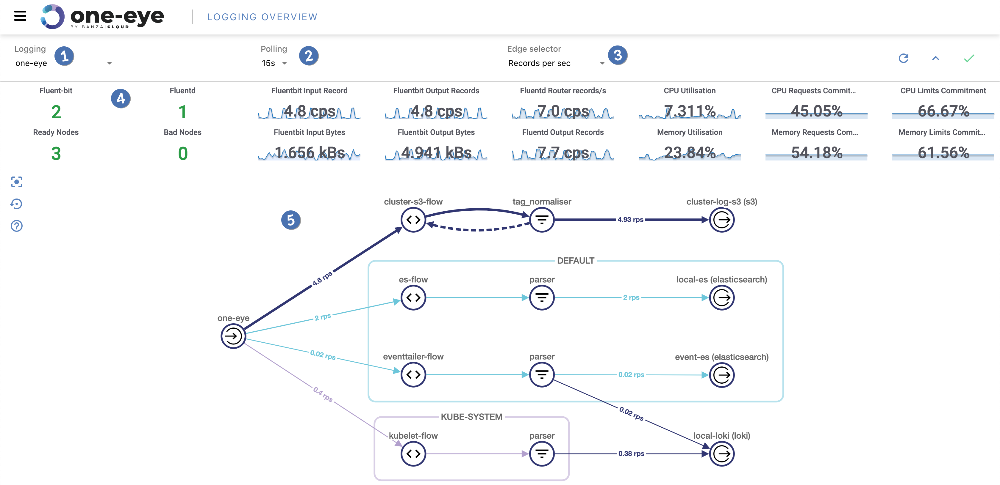

The **MENU > LOGGING OVERVIEW** page on the One Eye web interface visualizes your logging configuration and annotates it with real-time information about throughput. Various metrics based on the current log traffic are also displayed. The topology page serves as a starting point for diagnosing problems within your logging infrastructure.
One Eye is integrated with Grafana for easy access to in-depth monitoring of various services.

The page shows the following information and controls:

1. [Namespace filters](#namespaces)
1. [Polling settings](#polling)
1. [Edge labels](#edge-labels)
1. [Statistics](#statistics)
1. [Logging layout](#layout)

## Namespaces

{}

## Polling

{}

## Edge labels

The labels on the edges of the graph can display various real-time information about the traffic between the configuration elements. You can display the following information:

- records per second,
- total number of records.

## Statistics

The following charts are shown about your logging infrastructure:

- The number and health information of the Fluentd and Fluent Bit nodes.
- Amount of input and output traffic (as records per second and kilobyte per second)
- CPU and memory usage information

To open a more detailed dashboard in Grafana, click any of the data in the statistics bar.
To hide the statistics bar, click the **^** icon in the top right.

## Logging layout {#layout}

Displays the configuration of the logging infrastructure (for example, your logging flows, filters, parsers, and outputs), in a visual graph.

The nodes in the graph are the elements of your logging configuration, while the arrows represent the traffic between the elements. This is based on metrics retrieved from Prometheus.

The graph serves as a visual monitoring tool, as it displays various errors and metrics in the system. Click the **?** icon on the left to show a legend of the graph to better understand what the icons mean in the graph.

- To display the metrics of a component in a sidebar, click on the component (for example, on an output), then select **Metrics**.
    

    - To open the related dashboards in [Grafana](https://grafana.com), click .

- To list the pods that belong to a logging flow, click the icon of the match selector of the logging flow, then select **Matching pods**. To display the [details of a pod](), click .

    

- To display the YAML configuration of the component, click on the component, then click **Configuration**.

## Drill-down to the pods and nodes

{}

## Configure your logging infrastructure

You can configure the logging infrastructure from the command line by configuring the [Logging operator](/docs/one-eye/logging-operator/) and the [Logging Extensions operator](/docs/one-eye/logging-extensions/). Currently the One Eye web interface offers limited support to configure logging flows and logging outputs.

> To modify the configuration of an existing object, click on the object on the **MENU > LOGGING OVERVIEW**, then select **Configuration**.

To create a new logging flow or a logging output on the UI, complete the following steps.

1. Navigate to **MENU > LOGGING OVERVIEW**, then click .
1. Select the type of resource you want to create (flow or output).
1. Select the namespace where you want to apply the new resource.
    
1. Import the YAML configuration of the resource, or create a new one in the browser. For details on the possible configuration values, see [Logging flows]() and [Logging outputs]().
1. Click **CREATE**. One Eye validates the configuration and creates the new resource.
